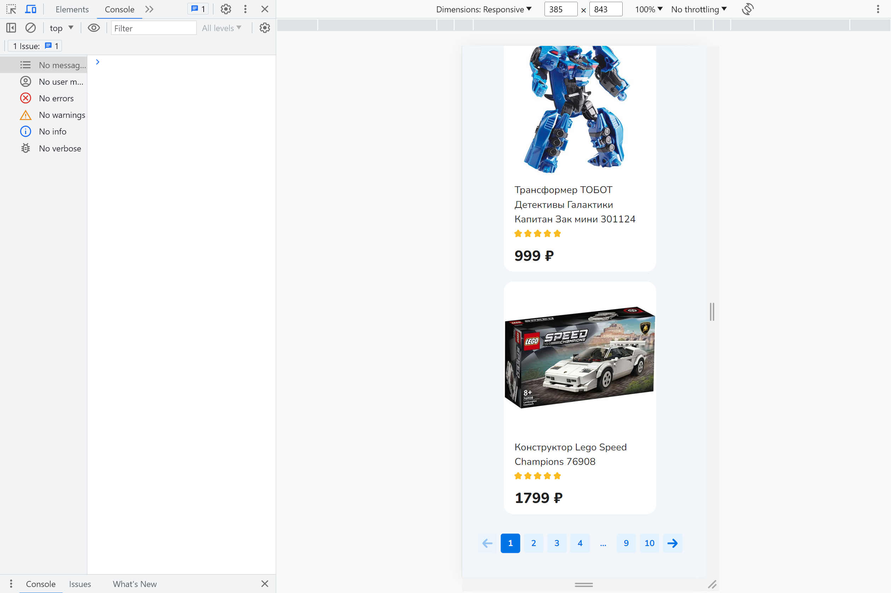

Дамы и господа, вашему вниманию представлен проект магазина "Синий кит", в котором вы любезно 
можете выбрать подходящие Вам товары и оформить заказ.

Проект выполнен с использованием следующих технологий:
-Язык программирования: TypeScript;
-Библиотека визуализации и отображения: Material UI;
-Менеджер хранения состояния: Redux Toolkit;
-Менеджер севрерных запросов, обновлений и хранения данных: RTK Query;
-Библиотека для создания пользовательского интерфейса: React.js;
-Фреймворк разработки: Next.js;
(Подробнее о версиях и дополнительных пакетах читайте в файле package.json)

Работа приложения:

1.Вы попадаете на первую страницу SPA "Детский мир", где вы можете выбрать любой товар для детального изучения и просмотра нажатием на этот товар.

-В нижней  части страницы вы можете перемещаться по страницам нажимая кнопки с номерами страниц или стрелки вперёд или назад.
 
2.После нажатия вы переходите на детальную страницу товара.
 
Здесь вы можете подробнее изучить один из товаров с выбранной вами страницы, товары зациклены по кругу: после крайнего или до первого вы попадёте соответственно на первый или крайний товар.
Кнопки страницы функциональные:
-Кнопка со стрелкой "назад": возвращает на страницу всех товаров;
-Кнопка "Предыдущий": покажет предыдущий товар;
-Кнопка "Следующий": покажет следующий товар;
-Кнопка "Добавить в корзину": показывает кнопку "Оформить заказ" и счётчик товара.

    -Счётчик товара: позволяет вам выбрать от одного до десяти штук данного товара, не пытайтесь заказать более 10шт вам выпадет предупреждение максимум 10шт. Счётчик товаров на этой странице синхронизирован с счётчиком корзины.
    -Кнопка "Оформить заказ" позволяет сделать заказ, если не превышены лимиты по сумме в 20000 р. и количество каждого товара не более 10шт.(Если лимиты не соблюдены кнопка блокируется и предлагает посмотреть состояние корзины , где также будут подсказки, что именно вы нарушили)
    
    
    Чтобы всё-таки сделать заказ, вернитесь в пределы лимитов и заказывайте нажатием кнопки 
    "Оформить заказ", кроме того кнопки типа "Оформить заказ" синхронизированы на странице 
    детального просмотра товара и в корзине. 
    
-Кнопка "Оформить заказ" позволяет сделать заказ, при нажатии на неё на сервере формируется ваш
заказ.
Важно!!! При нажатии данной кнопки на странице детального заказа на сервере формируется весь 
заказ, находящийся в этот момент в корзине.
-Кнопка-иконка "Корзина" показывает состояние корзины, служит подсказчиком клиенту в случае его неправильного заказа, а также отображает "Корзина пуста. Необходимо выбрать товар!", в случае, если корзина ещё пуста. 

Также при успешном выполнении заказа покажет "Заказ успешно выполнен. Заказывайте ещё!"

-Кнопка "Заказы" позволяет попасть на страницу со всеми вашими заказами и организована по 
принципу прокрутки страницы вниз, снизу вы увидите оповещение "Больше заказов нет!".
, здесь также есть информация о дате заказа и его стоимости.

Приложение является адаптивным как в Desctop так и в Mobile версиях с разрешением до 385px.





Routing осуществляется с помощью методов Next.js. Для чистоты кода применены помимо линтера Next, линтер ESLint а также Husky перед коммитами.

This is a [Next.js](https://nextjs.org/) project bootstrapped with [`create-next-app`](https://github.com/vercel/next.js/tree/canary/packages/create-next-app).

## Getting Started

First, run the development server:

```bash
npm run dev
# or
yarn dev
# or
pnpm dev
```

Open [http://localhost:3000](http://localhost:3000) with your browser to see the result.

You can start editing the page by modifying `app/page.tsx`. The page auto-updates as you edit the file.

This project uses [`next/font`](https://nextjs.org/docs/basic-features/font-optimization) to automatically optimize and load Inter, a custom Google Font.

## Learn More

To learn more about Next.js, take a look at the following resources:

- [Next.js Documentation](https://nextjs.org/docs) - learn about Next.js features and API.
- [Learn Next.js](https://nextjs.org/learn) - an interactive Next.js tutorial.

You can check out [the Next.js GitHub repository](https://github.com/vercel/next.js/) - your feedback and contributions are welcome!

## Deploy on Vercel

The easiest way to deploy your Next.js app is to use the [Vercel Platform](https://vercel.com/new?utm_medium=default-template&filter=next.js&utm_source=create-next-app&utm_campaign=create-next-app-readme) from the creators of Next.js.

Check out our [Next.js deployment documentation](https://nextjs.org/docs/deployment) for more details.
